# Workshop: Azure Durable Functions

## Introducción

La idea de este workshop es aprender a crear nuestrar primera Durable Function, aprendiendo a implementar dos de los patrones más comunes:
* Function chaining
* Fan out / Fan in

### Requisitos

* Visual Studio 2017 o superior (también podemos usar la consola junto con Visual Studio Code o nuestro editor favorito, pero aquí nos enfocaremos en la experiencia con Visual Studio) con las tools de desarrollo para Azure instaladas
* .NET Core 2.x SDK
* Node.js 8.5 o superior
* Azure Functions Core tools 2.6.666 o superior
* Para crear y administrar los recursos en Azure usaremos Azure CLI 2.0 o superior

## Creando nuestro proyecto

Lo primero que necesitamos es crear nuestro proyecto, por lo cual abriremos Visual Studio, en mi caso la versión 2019, y crearemos un nuevo proyecto:

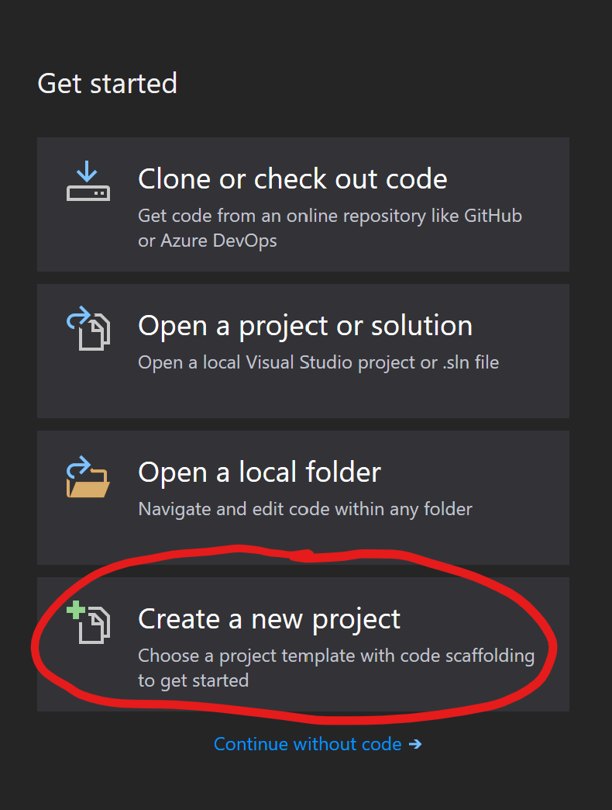

Allí podremos filtrar fácilmente para encontrar nuestro proyecto de Azure Functions:

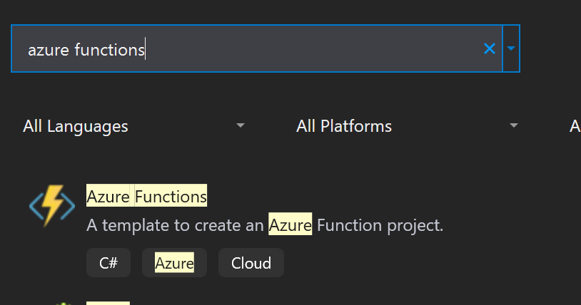

Le damos un nombre y continuamos:

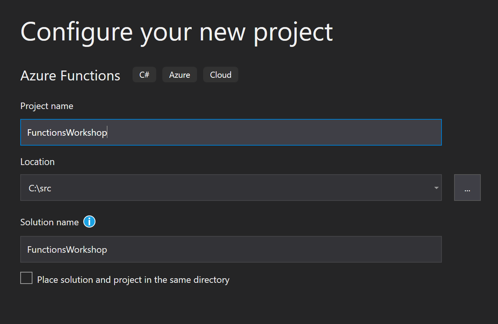

Luego podremos elegir dos cosas:
1. El runtime de Azure Functions que vamos a usar:
  * Azure Functions v1 (.NET Framework)
  * Azure Functions v2 (.NET Core)
2. El tipo de template con el que vamos a comenzar

Elegimos **Azure Functions v2 (.NET Core)** y **Empty**, como se muestra en la imagen:

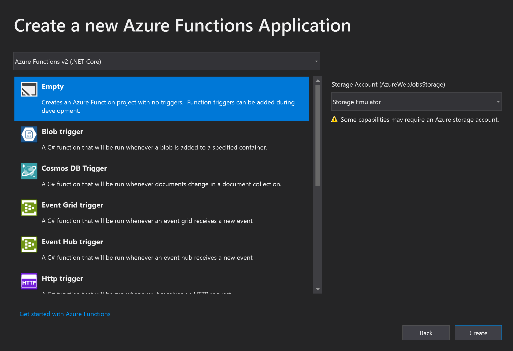

Y le damos a Create.

En esta pantalla también podemos elegir la cuenta de storage que usaremos, en este caso dejaremos el **Storage Emulator** para hacer desarrollo local.

Una vez creado nuestro proyecto debería verse como la siguiente imagen:

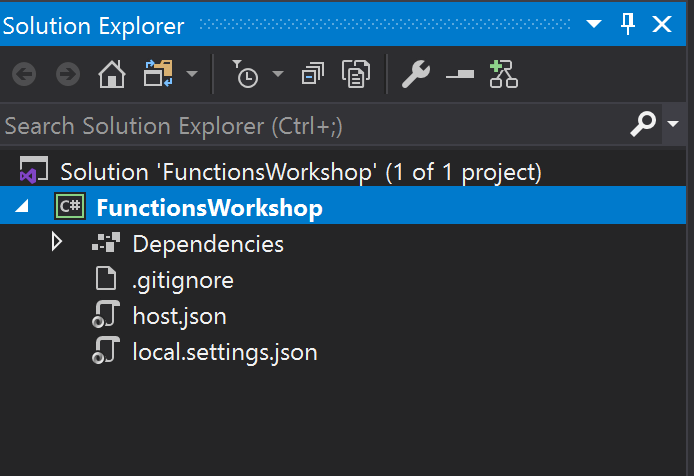

## Agregando soporte para Durable Functions

En este momento nuestro proyecto está listo para crear Azure Functions, pero todavía no Durable Functions, todavía tenemos que agregar el paquete de NuGet correspondiente.

Para ello vamos a hacer clic derecho sobre **Dependencies**, y elegiremos **Manage NuGet Packages...**:

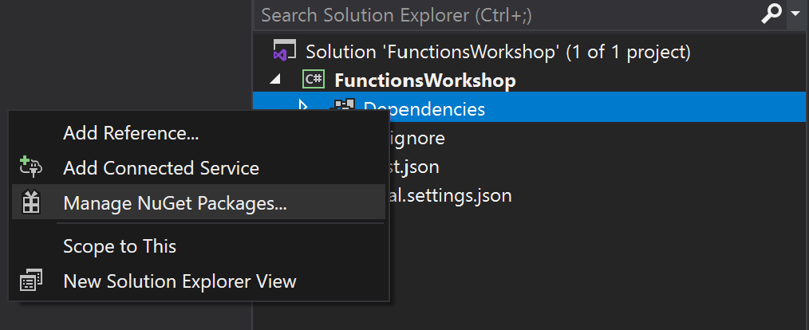

Y allí, en la solapa **Browse** buscaremos *durable functions*, para instalar el paquete **Microsoft.Azure.WebJobs.Extensions.DurableTask** en su versión 2.0.0:

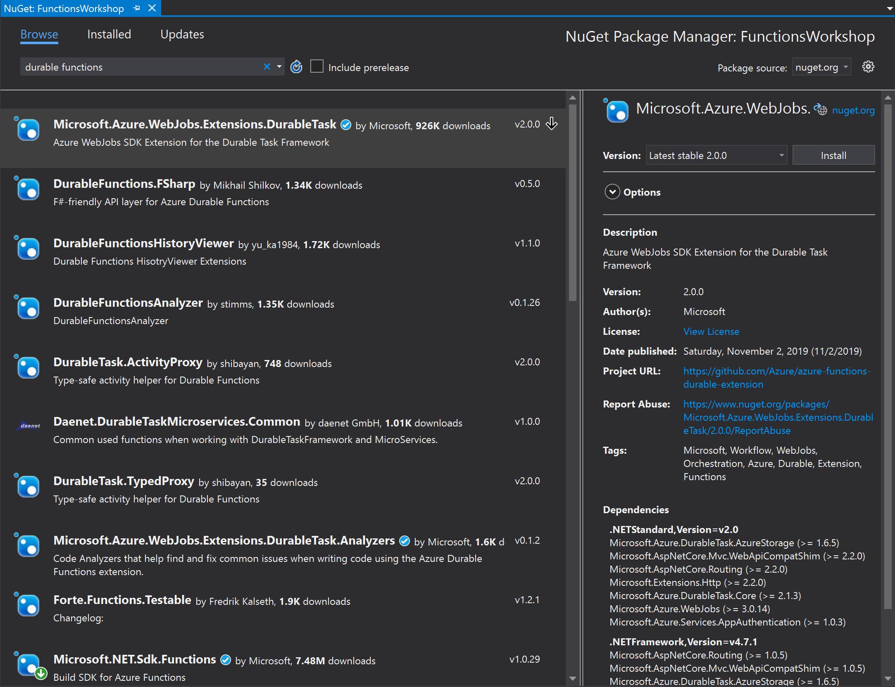

Aceptamos las licencias correspondientes:

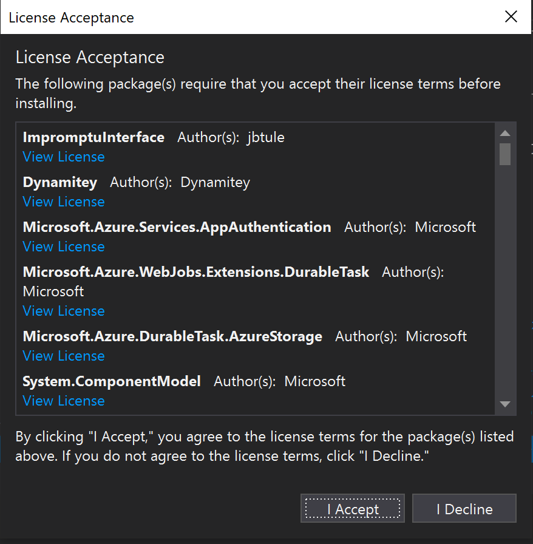

## Creando nuestra client function

Lo primero que haremos será crear nuestra función que actuará como cliente, respondiendo a un request HTTP, y llamando al orquestador.

Hacemos clic derecho sobre el proyecto, seleccionamos *Add*, y luego *New Azure Function...*

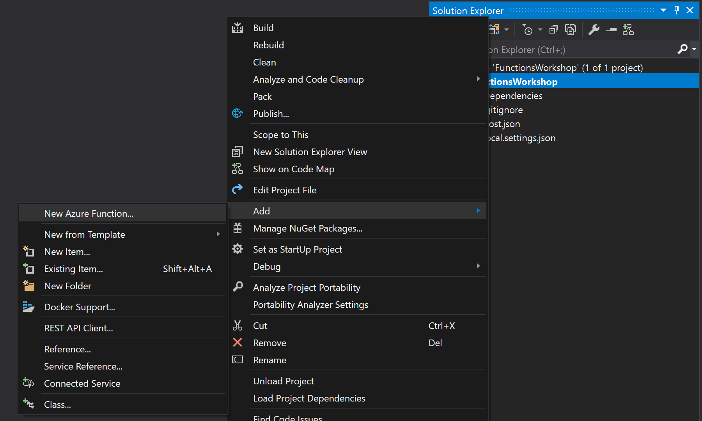

En el diálogo que se despliega le damos un nombre a la clase:

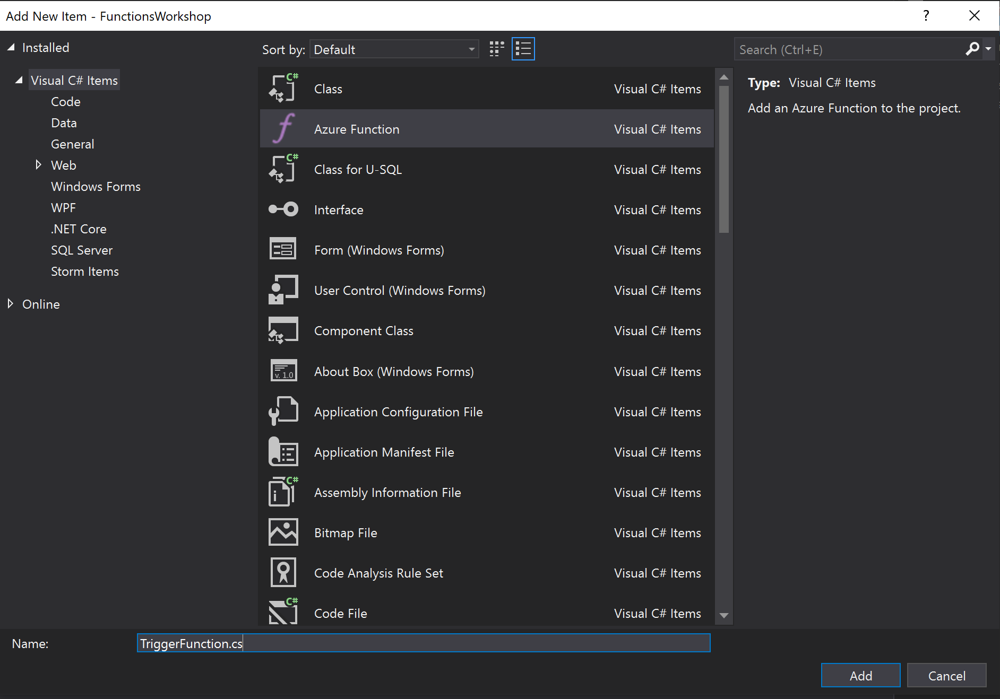

En este caso, y para simplificar las pruebas, eligiremos **Http trigger**:

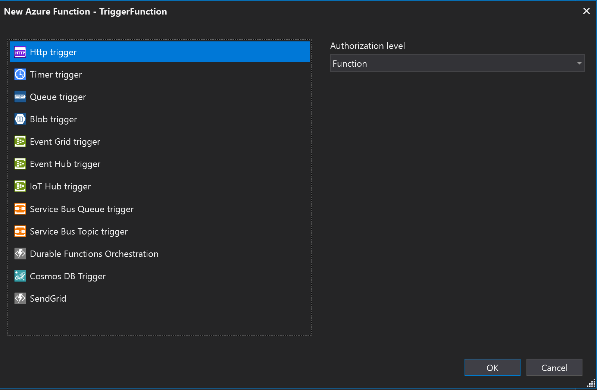

Esto nos creará una Azure Function normal con un Http trigger, cuyo código debería verse como el siguiente:

``` csharp
using System;
using System.IO;
using System.Threading.Tasks;
using Microsoft.AspNetCore.Mvc;
using Microsoft.Azure.WebJobs;
using Microsoft.Azure.WebJobs.Extensions.Http;
using Microsoft.AspNetCore.Http;
using Microsoft.Extensions.Logging;
using Newtonsoft.Json;

namespace FunctionsWorkshop
{
    public static class TriggerFunction
    {
        [FunctionName("TriggerFunction")]
        public static async Task<IActionResult> Run(
            [HttpTrigger(AuthorizationLevel.Function, "get", "post", Route = null)] HttpRequest req,
            ILogger log)
        {
            log.LogInformation("C# HTTP trigger function processed a request.");

            string name = req.Query["name"];

            string requestBody = await new StreamReader(req.Body).ReadToEndAsync();
            dynamic data = JsonConvert.DeserializeObject(requestBody);
            name = name ?? data?.name;

            return name != null
                ? (ActionResult)new OkObjectResult($"Hello, {name}")
                : new BadRequestObjectResult("Please pass a name on the query string or in the request body");
        }
    }
}
```

## Agregando nuestro orquestador

Como primer paso, agregamos el cliente como parámetro de nuestra función:

``` csharp
[FunctionName("TriggerFunction")]
public static async Task<IActionResult> Run(
    [HttpTrigger(AuthorizationLevel.Function, "get", "post", Route = null)] HttpRequest req,
    [DurableClient] IDurableOrchestrationClient starterClient,
    ILogger log)
{
```

Luego vamos a aprovechar parte del código que ya tenemos para reutilizarlo en nuestro ejemplo, y vamos a tomar el *name* que recibimos del request para pasarlo al orquestador, pero antes tenemos que validar que haya venido algo, o sino, devolver un error:

Para esto vamos a cambiar nuestro return (queremos validar y seguir ejecutando):

```csharp
return name != null
    ? (ActionResult)new OkObjectResult($"Hello, {name}")
    : new BadRequestObjectResult("Please pass a name on the query string or in the request body");
```

por la validación:

```csharp
if (name == null)
{
    return new BadRequestObjectResult("Please pass the image location in the query string or in the request body");
}
```

A continuación, agregamos algo de información para saber que estamos por ejecutar:

```csharp
log.LogInformation($"About to start orchestration for {name}");
```

Luego llamamos a nuestro orquestador:

```csharp
var orchestrationId = await starterClient.StartNewAsync("ProcessImageOrchestrator", null, name);
```

Y finalmente retornamos:

```csharp
return starterClient.CreateCheckStatusResponse(req, orchestrationId);
```

Nuestra función completa quedaría así:

```csharp
[FunctionName("ProcessImageStarter")]
public static async Task<IActionResult> Run(
    [HttpTrigger(AuthorizationLevel.Function, "get", "post", Route = null)] HttpRequest req,
    [DurableClient] IDurableOrchestrationClient starterClient,
    ILogger log)
{
    string name = req.Query["name"];

    string requestBody = await new StreamReader(req.Body).ReadToEndAsync();
    dynamic data = JsonConvert.DeserializeObject(requestBody);
    name = name ?? data?.name;

    if (name == null)
    {
        return new BadRequestObjectResult("Please pass the image location in the query string or in the request body");
    }

    log.LogInformation($"About to start orchestration for {name}");

    var orchestrationId = await starterClient.StartNewAsync("ProcessImageOrchestrator", null, name);

    return starterClient.CreateCheckStatusResponse(req, orchestrationId);
}
```

## Implementando el orquestador

Creamos una nueva clase llamada **ProcessImageOrchestrator**, en ella vamos a crear nuestra función de orquestación.

Lo primero que necesitamos es tener un método asociado al contexto:

```csharp
public static class ProcessImageOrchestrator
{
    [FunctionName("ProcessImageOrchestrator")]
    public static async Task<object> RunOrchestrator(
        [OrchestrationTrigger] IDurableOrchestrationContext context,
        ILogger log)
    {

    }
}
```

Es importante notar que el valor que ponemos en **FunctionName** debe ser igual al que usamos en la clase anterior para llamar al orquestador.

Ahora, como primer paso, vamos a obtener los valores que recibimos como parámetros, para ello usamos la función **GetInput** de nuestro *context*, en nuestro caso, es un *string* con la ubicación de una imagen que queremos procesar:

```csharp
var imageLocation = context.GetInput<string>();
```

Una vez obtenido este valor, podemos llamar a nuestras Activities:

```csharp
var thumbnail = await context.CallActivityAsync<string>("GenerateThumbnailActivity", imageLocation);
var withWatermark = await context.CallActivityAsync<string>("AddWatermarkActivity", imageLocation);
```

Y finalmente vamos a retornar un objeto anónimo con esos valores:

```csharp
return new
{
    Thumbnail = thumbnail,
    WithWatermark = withWatermark,
};
```

La clase completa quedaría así:

```csharp
using Microsoft.Azure.WebJobs;
using Microsoft.Azure.WebJobs.Extensions.DurableTask;
using Microsoft.Extensions.Logging;
using System.Threading.Tasks;

namespace DurableFunctionsChaining
{
    public static class ProcessImageOrchestrator
    {
        [FunctionName("ProcessImageOrchestrator")]
        public static async Task<object> RunOrchestrator(
            [OrchestrationTrigger] IDurableOrchestrationContext context,
            ILogger log)
        {
            var imageLocation = context.GetInput<string>();

            var thumbnail = await context.CallActivityAsync<string>("GenerateThumbnailActivity", imageLocation);
            var withWatermark = await context.CallActivityAsync<string>("AddWatermarkActivity", imageLocation);

            return new
            {
                Thumbnail = thumbnail,
                WithWatermark = withWatermark,
            };
        }
    }
}
```

## Implementando las activities

Creamos una nueva clase llamada **ProcessImages**, con un método como el siguiente:

```csharp
public class ProcessImageActivities
{
    [FunctionName("GenerateThumbnailActivity")]
    public static async Task<string> GenerateThumbnail([ActivityTrigger] string imageName,
        ILogger log)
    {

    }
}
```

Nuevamente, el valor de **FunctionName** debe coincidir con el que pusimos en el llamado de la clase anterior.

En este caso, y para simplificar el ejemplo, vamos a simular que el proceso está haciendo algo con un `Task.Delay()`:

```csharp
[FunctionName("GenerateThumbnailActivity")]
public static async Task<string> GenerateThumbnail([ActivityTrigger] string imageName,
    ILogger log)
{
    log.LogInformation($"Generating thumbnail for {imageName}");

    // simulate doing the activity
    await Task.Delay(5000);

    return "thumbnail.jpg";
}
```

Agregamos nuestra segunda activity, que tiene un código muy similar:

```csharp
[FunctionName("AddWatermarkActivity")]
public static async Task<string> AddWatermark([ActivityTrigger] string imageName,
    ILogger log)
{
    log.LogInformation($"Adding watermark to {imageName}");

    // simulate doing the activity
    await Task.Delay(5000);

    return $"{imageName}_watermark.jpg";
}
```

Nuestra clase completa quedaría así:

```csharp
using Microsoft.Azure.WebJobs;
using Microsoft.Azure.WebJobs.Extensions.DurableTask;
using Microsoft.Extensions.Logging;
using System.Threading.Tasks;

namespace DurableFunctionsChaining
{
    public class ProcessImageActivities
    {
        [FunctionName("GenerateThumbnailActivity")]
        public static async Task<string> GenerateThumbnail([ActivityTrigger] string imageName,
            ILogger log)
        {
            log.LogInformation($"Generating thumbnail for {imageName}");

            // simulate doing the activity
            await Task.Delay(5000);

            return "thumbnail.jpg";
        }

        [FunctionName("AddWatermarkActivity")]
        public static async Task<string> AddWatermark([ActivityTrigger] string imageName,
            ILogger log)
        {
            log.LogInformation($"Adding watermark to {imageName}");

            // simulate doing the activity
            await Task.Delay(5000);

            return $"{imageName}_watermark.jpg";
        }
    }
}
```

## Agregando logs a nuestro orquestador

Nuestro orquestador luego de llamar a una activity se duerme, y al recibir un resultado vuelve a despertar, pero la ejecución del código comienza nuevamente desde el principio. Por lo tanto, si escribimos directamente un log, el mismo se va a escribir en todas las ejecuciones, y no queremos eso. Para solucionar esto, el *context* tiene una propiedad que nos indica si está ejecutando nuevamente esa porción de código: `IsReplaying`.

Usando esta función podemos agregar logs a la ejecución de nuestro orquestador para saber por donde va ejecutando.

Modifiquemos entonces nuestra función de orquestación para agregar los logs antes del llamado a cada actividad:

```csharp
if (!context.IsReplaying)
{
    log.LogInformation("About to generate thumbnail");
}
var thumbnail = await context.CallActivityAsync<string>("GenerateThumbnailActivity", imageLocation);

if (!context.IsReplaying)
{
    log.LogInformation("About to add watermark");
}
var withWatermark = await context.CallActivityAsync<string>("AddWatermarkActivity", imageLocation);
```

## Ejecutando nuestra función

Con esto ya estamos listos para correr nuestra primera función, la corremos como a cualquier otra aplicación en Visual Studio, usando F5 o el botón de play.

Esto abrirá una consola, que comenzará a correr el runtime de Azure Functions:

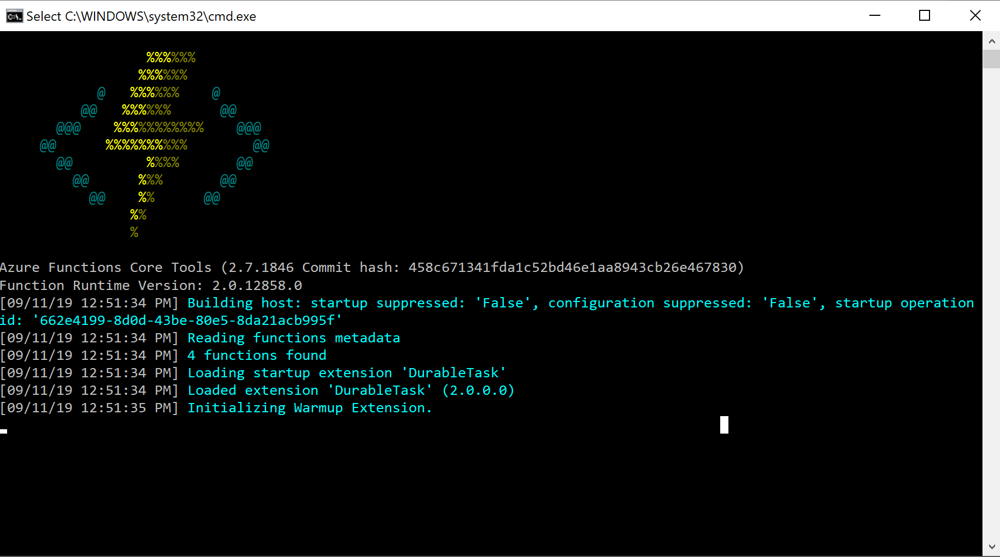

Una vez que termina de levantar todo lo que necesita, nos va a dar la URL con la que podremos llamarla:

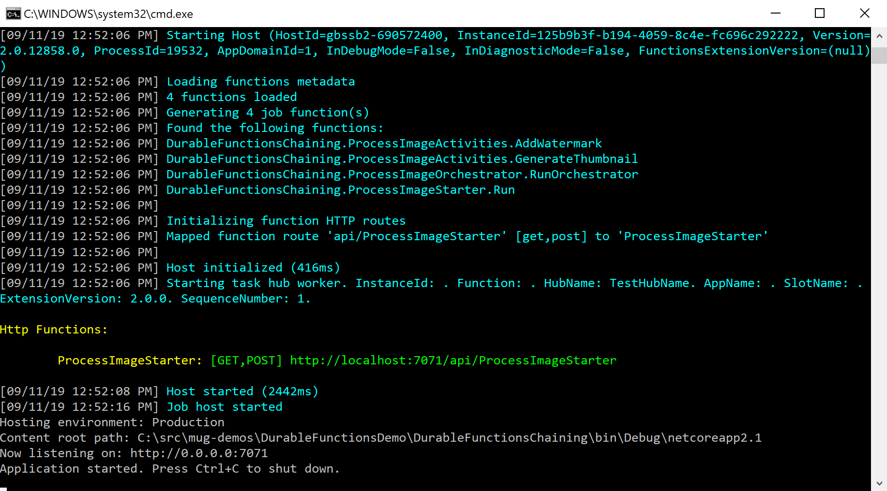

Si vamos al browser, y usando esa URL junto con el parámetro de query string **name** y el nombre de una imagen, llamaremos a nuestra función:

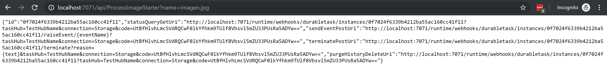

y veremos en la consola lo que va sucediendo con ella:

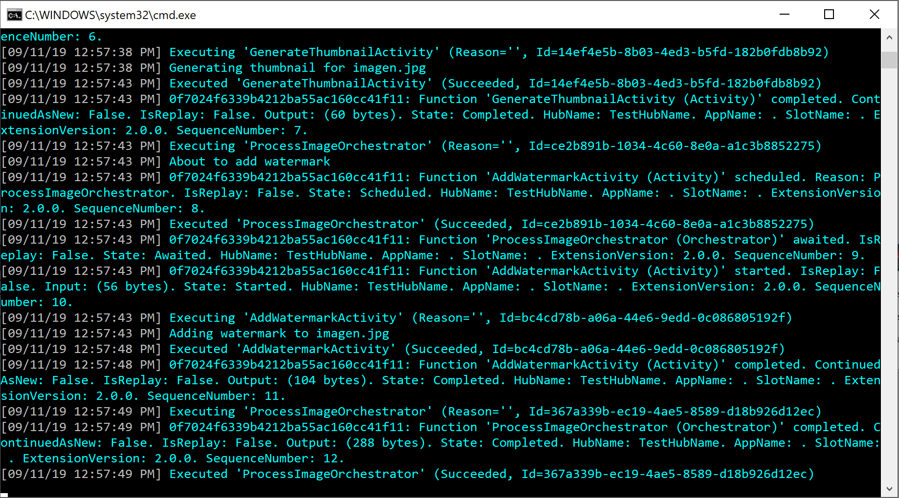


# Desafíos

Con esto tenemos creada nuestra primera Durable Function, pero no hace nada útil.

¿Te animas a implementar los siguientes desafíos?

1. Implementar las activities con código real para redimensionar la imagen y agregarle una marca de agua.
1. Agregar una primera actividad que usando servicios cognitivos valide que la imagen no contenga contenido indebido.
1. Cambiar la función de trigger para que el proceso se dispare al subir la imagen a blob storage.